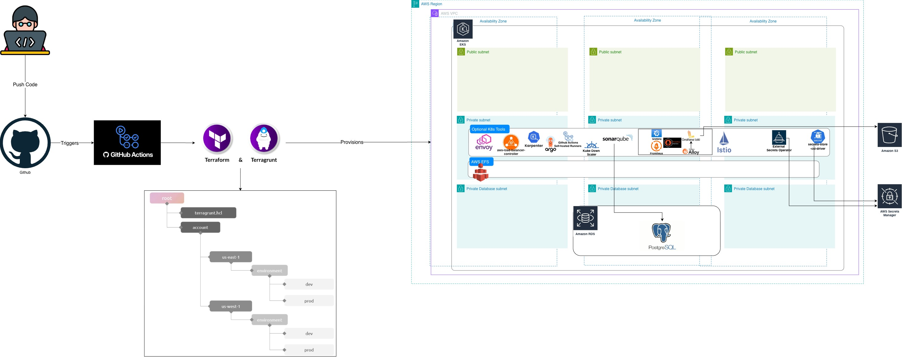
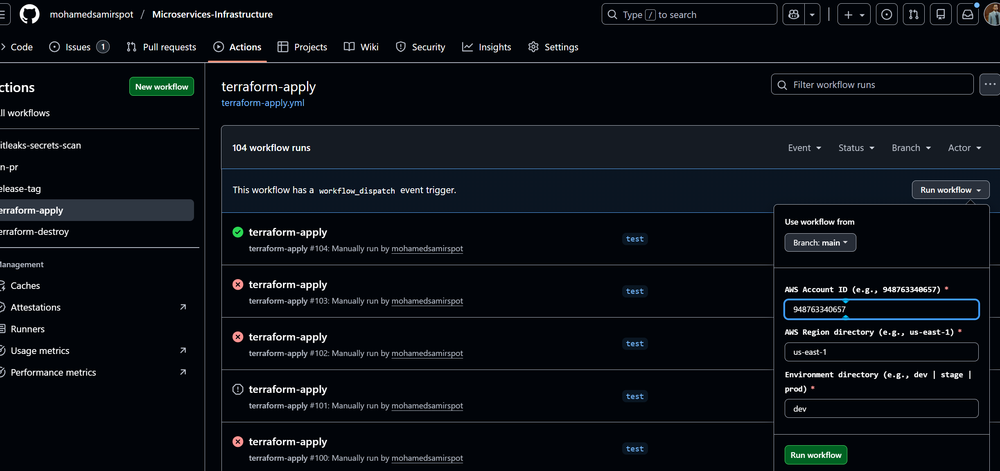
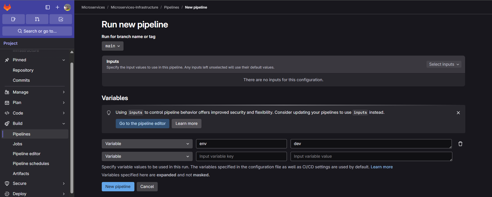
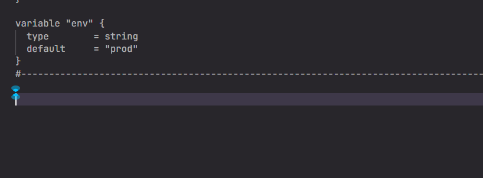

# Infrastructure Installation (Terraform + Terragrunt)
These terraform components (modules and k8s-tools) can create the following so far:

- AWS Modules
  - aws-network
  - aws-eks
  - aws-efs
- k8s-tools
  - argocd
  - argocd-image-updater
  - aws-load-balancer-controller
  - envoy-gateway-api
  - external-secrets-operator
  - gateway-api-crds
  - gha-runner
  - karpenter
  - kube-downscaler
  - monitoring
    - grafana-alloy
    - grafana
    - loki
    - prometheus
  - secrets-store-csi-driver
  - sonarqube
  - stakater-reloader
# Notes
- This repo is authenticated with aws through OIDC Reference --> https://www.youtube.com/watch?v=Sdzd4N6L5Hg
- All of these components are flagable which means you can easily enable or disable any module or tool that you don't want through the env.hcl file for example --> "./aws-accounts/{account-id}/us-east-1/dev/env.hcl"
- Push and commits pipelines are disabled so you need to run the pipeline manually and pass the env variable each time with the right value
  - Github Action

  - Gitlab-CI

