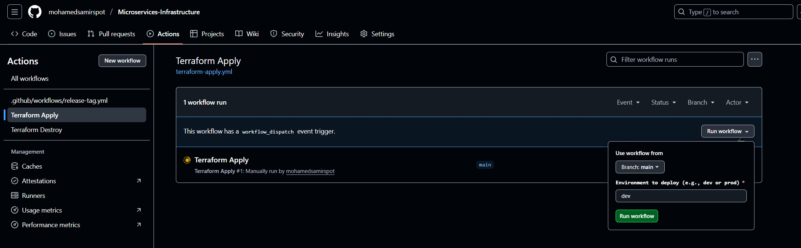

# Infrastructure Installation (Terraform)
These terraform components (modules and k8s-tools) can create the following so far:

- AWS Modules
  - aws-network
  - aws-eks
  - aws-efs
- k8s-tools
  - k8s-karpenter
  - alb-ingress-controller
  - argocd
# Notes
## To add a new env just copy one of the directories and make sure to make change the following 2 env name variables
- `~/envs/${env}/provider.tf --> backend s3 key env name "${env}/eks-cluster/terraform.tfstate"`

```bash
  backend "s3" {
    bucket       = "terraform-state-multi-env-spot"
    key          = "prod/eks-cluster/terraform.tfstate"
    region       = "us-east-1"
    encrypt      = true
    use_lockfile = true
  }
```
# Push and commits pipelines are disabled so you need to run the pipeline manually and pass the env variable each time with the right value

## Github Action



## Gitlab-CI


